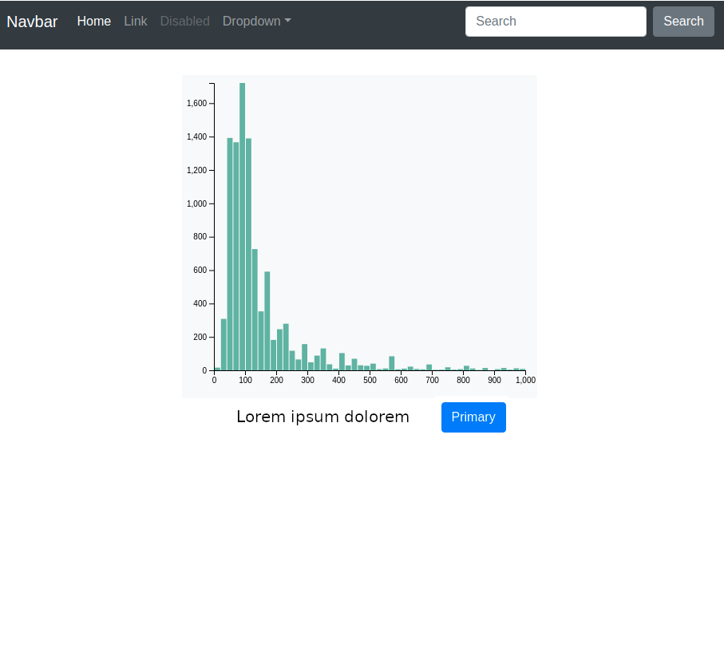

# Frontend Working Student Challenge
This challenge will test your understanding and ability to combine some of the technologies
we are using to create Web-UI applications

## Task
Modify this [bootstrap example](https://getbootstrap.com/docs/4.5/examples/sticky-footer-navbar/) to embed 
this [d3.js histogram](https://www.d3-graph-gallery.com/graph/histogram_basic.html) in a simple HTML page, according to the following page design.

## Hints

Bootstrap buttons component: https://getbootstrap.com/docs/4.5/components/buttons/

d3.js first steps: https://www.dashingd3js.com/d3js-first-steps

Embedding d3.js in bootstrap: https://riptutorial.com/d3-js/example/15062/using-bootstrap

## Deliverable

A single HTML page with the above mentioned design

## Good luck and we are very excited to see your solutions! 
The next step in the interview process is then a personal meeting at our office.

## Note: We don't expect you to build THE perfect solution.
Our goal here is:
* See how you approach such a problem
* Get an idea of your programming skills and tools you can use
